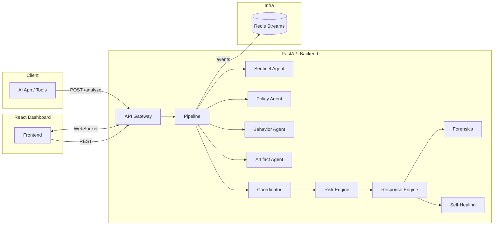

# AUTO DEFENSE

Autonomous, event-driven, multi-agent defense system that monitors AI inputs, outputs, and tool calls in real time — scoring risk, responding autonomously, self-healing with dynamic guardrails, and streaming full observability to a React dashboard.

**AES-256-GCM encryption by default** — each 32-byte master key (transport + at-rest) derives one HKDF-SHA256 AES key (`autodefense-aes-v3`) for single-layer AEAD. Legacy v2/v1 envelopes remain decryptable. Details: [Security → Encryption](docs/security.md#encryption). Keys can be auto-generated on first run via `scripts/start.sh`.

This software uses **pattern-based heuristics and configurable rules**. It **does not guarantee** detection of every attack, elimination of false positives, or fitness for any particular compliance regime or threat model. Evaluate against your own requirements.



## Getting started (from git clone)

### Prerequisites

| Tool | Required for |
|------|----------------|
| **Git** | Clone the repository |
| **Docker** + **Docker Compose v2** | Full stack (recommended) |
| **OpenSSL** or **Python 3** | Auto-generating secrets in `scripts/start.sh` |

For local backend/frontend development without Docker, see [docs/setup.md](docs/setup.md) (Python 3.11+, Node.js 20+, optional Redis).

### Step 1 — Clone the repository

```bash
git clone https://github.com/Legendarylibrorg/AutoDefense.git
cd AutoDefense
```

Use your fork URL if you contribute via a fork.

### Step 2 — Create environment file

```bash
cp .env.example .env
```

The start script (next step) copies this automatically if `.env` is missing and fills any **empty** secrets for local development: API key, scanner HMAC key, Redis password, data encryption key, and transport key.

### Step 3 — Start the stack

```bash
# macOS / Linux
chmod +x scripts/start.sh
./scripts/start.sh

# Windows (PowerShell)
Set-ExecutionPolicy -Scope Process -ExecutionPolicy Bypass
.\scripts\start.ps1
```

The script will:

1. Ensure `.env` exists.
2. Generate any still-empty secrets (`openssl` or `python3`).
3. Print your **API key once** — save it for the dashboard and API calls.
4. Validate the Compose config, then run **`docker compose up --build`**.

Wait until all containers are healthy (backend, frontend, Redis).

### Step 4 — Open the dashboard

| URL | What |
|-----|------|
| http://localhost:3000 | React dashboard |
| http://localhost:8000/health | Health check (no auth) |
| http://localhost:8000/docs | Swagger API docs — only when `AUTODEFENSE_ENVIRONMENT=local` |

### Step 5 — Connect the dashboard

1. Open http://localhost:3000
2. Expand **API session keys** in the header.
3. Paste the API key printed by `scripts/start.sh` (or read it from `.env`: `AUTODEFENSE_API_KEY`).
4. If sealed transport is enabled (default), also paste **Transport key** from `AUTODEFENSE_TRANSPORT_KEY_B64` in `.env`.
5. Click **Save and reload**.

The live event feed should show **Live** (green) when connected.

### Step 6 — Verify the API (optional)

```bash
API_KEY=$(grep '^AUTODEFENSE_API_KEY=' .env | cut -d= -f2-)

curl -s http://localhost:8000/health | python3 -m json.tool

curl -s -X POST http://localhost:8000/analyze \
  -H "Authorization: Bearer $API_KEY" \
  -H "Content-Type: application/json" \
  -d '{"user_input":"Hello, world"}' | python3 -m json.tool
```

### Optional — Compose profiles

```bash
docker compose --profile demo up --build       # attack simulator
docker compose --profile security up --build   # Linux kernel scanner sidecar
```

### Next steps

| Topic | Document |
|-------|----------|
| Local dev (no Docker), host scanners, full env reference | [docs/setup.md](docs/setup.md) |
| All environment variables | [docs/configuration.md](docs/configuration.md) |
| Encryption (HKDF subkeys, sealed transport) | [docs/security.md](docs/security.md#encryption) |
| Production deployment | [docs/deployment.md](docs/deployment.md) |

## Quick start (one command)

If you already cloned the repo and have Docker installed:

```bash
# macOS / Linux
./scripts/start.sh

# Windows PowerShell
.\scripts\start.ps1
```

This copies `.env.example` to `.env` when needed, auto-generates keys, and runs `docker compose up --build`.

## What it defends against

Coverage mapped to [OWASP LLM Top 10 (2025)](https://genai.owasp.org/resource/owasp-top-10-for-llm-applications-2025/) and [OWASP Agentic AI Top 10 (2026)](https://genai.owasp.org/resource/owasp-top-10-for-agentic-applications-for-2026/):

| Threat | Defense |
|--------|---------|
| Prompt injection | 17 injection + 26 jailbreak patterns, encoding evasion, multi-language (FR/DE/ES/JA/ZH/RU), self-healing rules |
| Sensitive info disclosure | 17 secret patterns, 7 PII detectors, system prompt leak detection, auto-redaction |
| Improper output handling | 14 XSS / injection patterns in model output |
| Excessive agency / tool abuse | 60+ tool abuse patterns, 16 code execution regexes |
| System prompt leakage | Input-side extraction blocking + output-side leak detection |
| Unbounded consumption | Rate limiting (120 req/min/IP), 10 MB body limit, Pydantic size constraints, artifact caps |
| Malicious artifacts | Extension blocking, polyglot detection, archive bombs (multi-entry), script markers |
| SSRF | 17 internal/metadata/cloud URL patterns + async DNS rebinding detection |
| Network sniffing & MITM | 30+ sniffer process detection, promiscuous interface detection, ARP spoofing, pcap files |
| Rootkits & kernel exploits | Linux kernel scanner (hidden procs, LD_PRELOAD, kernel modules, sysctl hardening) |

Counts in this table are **illustrative** and can change as rules evolve; they are not a runtime contract.

## Security hardening

The codebase has been refined through **multiple internal security-focused review passes** during development (summarized in [docs/security.md](docs/security.md)). That is **not** a substitute for independent penetration testing, formal certification, or your own deployment reviews.

| Area | Hardening |
|------|-----------|
| **Encryption** | AES-256-GCM (v3): one HKDF-derived key per 32-byte master; legacy v2/v1 decrypt supported |
| **Authentication** | Constant-time API key comparison (HMAC), WebSocket auth via `Sec-WebSocket-Protocol` header (no query param leakage) |
| **Input validation** | NFKC Unicode normalization, zero-width character stripping, ReDoS guards on all dynamic regexes (config + rules), Pydantic field constraints |
| **SSRF** | Regex patterns + numeric IP resolution (hex/octal/decimal) + non-blocking async DNS with 2s timeout |
| **DoS protection** | 10 MB body limit (Content-Length + chunked), per-IP rate limiting in **Redis** (shared across workers), WebSocket timeouts + connection caps |
| **Infrastructure** | Non-root Docker containers, Redis password via `REDISCLI_AUTH` (no process list leaks), hardened Nginx CSP, platform info redaction in production |
| **Self-healing** | Dynamic rules actually loaded and applied per-request, validated against ReDoS before activation |
| **Crypto integrity** | `alg:none` downgrade rejection, HMAC-SHA256 scanner payload signing, sealed transport with AAD binding |

## Project structure

```
AUTO DEFENSE/
├── backend/                 # FastAPI + Python agents + Redis event bus
│   ├── app/
│   │   ├── agents/          # Sentinel, Policy, Behavior, Artifact, Coordinator, Forensics, Kernel
│   │   ├── api/routes/      # REST + WebSocket + SSE endpoints
│   │   ├── core/            # Crypto, risk engine, response engine, self-heal, models
│   │   ├── policies/        # Default blocked/sanitize regexes
│   │   └── services/        # Defense pipeline orchestration
│   └── tests/               # pytest suite
├── frontend/                # React 19 + Tailwind + Vite dashboard
│   └── src/
│       ├── components/      # StatCard, RiskChart, EventFeed, ConfigPanel, KernelHealth, ...
│       ├── lib/             # API client, WebSocket hook
│       └── pages/           # App layout
├── scanners/                # Shared helpers imported by platform scanners
├── kernel/                  # Linux host scanner (needs repo `scanners/` on path)
├── macos/                   # macOS host scanner (needs repo `scanners/` on path)
├── windows/                 # Windows host scanner (needs repo `scanners/` on path)
├── simulations/             # Attack simulation scripts
├── scripts/                 # Start scripts (sh + ps1)
├── docs/                    # Documentation
├── SECURITY.md              # Vulnerability reporting
├── CONTRIBUTING.md          # Development and PR guidelines
├── CHANGELOG.md             # Release notes
├── CODE_OF_CONDUCT.md       # Community standards
└── docker-compose.yml
```

## Contributing / security / changelog

| Document | Contents |
|----------|----------|
| [CONTRIBUTING.md](CONTRIBUTING.md) | Local dev, tests, PR expectations |
| [SECURITY.md](SECURITY.md) | Vulnerability reporting (private / coordinated disclosure) |
| [CHANGELOG.md](CHANGELOG.md) | Release-oriented change summary |
| [Code of Conduct](CODE_OF_CONDUCT.md) | Community expectations |

## Documentation

| Document | Contents |
|----------|----------|
| [Setup from clone](docs/setup.md) | Git clone → `.env` → Docker or local backend/frontend → scanners |
| [Architecture](docs/architecture.md) | System design, agent pipeline, data flow, event streaming |
| [API Reference](docs/api.md) | Every endpoint with request/response examples |
| [Security](docs/security.md) | Threat model, encryption, OWASP coverage matrix, attack patterns |
| [Host Scanners](docs/scanners.md) | Linux, macOS, and Windows scanner documentation |
| [Configuration](docs/configuration.md) | All environment variables, runtime config, tuning |
| [Deployment](docs/deployment.md) | Docker install, local dev, testing, production ops |
| [GitHub: protect `main`](docs/maintainers/github-repository-setup.md) | Rulesets, PR-only workflow, required CI (`gh` script) |

## License

MIT — see [LICENSE](LICENSE).
