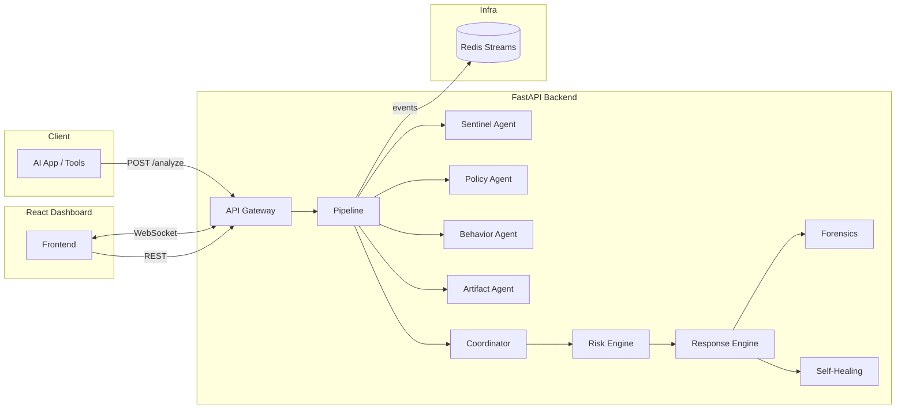

# AUTO DEFENSE

Autonomous, event-driven, multi-agent defense system that monitors AI inputs, outputs, and tool calls in real time — scoring risk, responding autonomously, self-healing with dynamic guardrails, and streaming full observability to a React dashboard.

**Double-layer AES-256-GCM encryption by default** — every payload passes through two independent encryption layers with HKDF-derived subkeys, HMAC-SHA256 integrity binding, and SHA-256 hash verification. Keys auto-generated on first run.



## Quick start

```bash
# macOS / Linux
./scripts/start.sh

# Windows PowerShell
.\scripts\start.ps1
```

This copies `.env.example` to `.env`, auto-generates encryption keys and API key, and runs `docker compose up --build`.

| URL | What |
|-----|------|
| http://localhost:3000 | Dashboard |
| http://localhost:8000/docs | API docs (Swagger) |
| http://localhost:8000/health | Health + platform info |

## What it defends against

Coverage mapped to [OWASP LLM Top 10 (2025)](https://genai.owasp.org/resource/owasp-top-10-for-llm-applications-2025/) and [OWASP Agentic AI Top 10 (2026)](https://genai.owasp.org/resource/owasp-top-10-for-agentic-applications-for-2026/):

| Threat | Defense |
|--------|---------|
| Prompt injection | 17 injection + 26 jailbreak patterns, encoding evasion, multi-language (FR/DE/ES/JA/ZH/RU), self-healing rules |
| Sensitive info disclosure | 17 secret patterns, 7 PII detectors, system prompt leak detection, auto-redaction |
| Improper output handling | 14 XSS / injection patterns in model output |
| Excessive agency / tool abuse | 60+ tool abuse patterns, 16 code execution regexes |
| System prompt leakage | Input-side extraction blocking + output-side leak detection |
| Unbounded consumption | Rate limiting (120 req/min/IP), 10 MB body limit, Pydantic size constraints, artifact caps |
| Malicious artifacts | Extension blocking, polyglot detection, archive bombs (multi-entry), script markers |
| SSRF | 17 internal/metadata/cloud URL patterns + async DNS rebinding detection |
| Network sniffing & MITM | 30+ sniffer process detection, promiscuous interface detection, ARP spoofing, pcap files |
| Rootkits & kernel exploits | Linux kernel scanner (hidden procs, LD_PRELOAD, kernel modules, sysctl hardening) |

## Security hardening

Six rounds of adversarial red-team auditing have hardened the system across every layer:

| Area | Hardening |
|------|-----------|
| **Encryption** | Double-layer AES-256-GCM with 3 HKDF-derived subkeys (inner, outer, HMAC) + SHA-256 hash — 4 independent crypto checks per payload |
| **Authentication** | Constant-time API key comparison (HMAC), WebSocket auth via `Sec-WebSocket-Protocol` header (no query param leakage) |
| **Input validation** | NFKC Unicode normalization, zero-width character stripping, ReDoS guards on all dynamic regexes (config + rules), Pydantic field constraints |
| **SSRF** | Regex patterns + numeric IP resolution (hex/octal/decimal) + non-blocking async DNS with 2s timeout |
| **DoS protection** | 10 MB body limit (Content-Length + chunked), per-IP rate limiting in **Redis** (shared across workers), WebSocket timeouts + connection caps |
| **Infrastructure** | Non-root Docker containers, Redis password via `REDISCLI_AUTH` (no process list leaks), hardened Nginx CSP, platform info redaction in production |
| **Self-healing** | Dynamic rules actually loaded and applied per-request, validated against ReDoS before activation |
| **Crypto integrity** | `alg:none` downgrade rejection, HMAC-SHA256 scanner payload signing, sealed transport with AAD binding |

## Project structure

```
AUTO DEFENSE/
├── backend/                 # FastAPI + Python agents + Redis event bus
│   ├── app/
│   │   ├── agents/          # Sentinel, Policy, Behavior, Artifact, Coordinator, Forensics, Kernel
│   │   ├── api/routes/      # REST + WebSocket + SSE endpoints
│   │   ├── core/            # Crypto, risk engine, response engine, self-heal, models
│   │   ├── policies/        # Default blocked/sanitize regexes
│   │   └── services/        # Defense pipeline orchestration
│   └── tests/               # pytest suite
├── frontend/                # React 18 + Tailwind + Vite dashboard
│   └── src/
│       ├── components/      # StatCard, RiskChart, EventFeed, ConfigPanel, KernelHealth, ...
│       ├── lib/             # API client, WebSocket hook
│       └── pages/           # App layout
├── kernel/                  # Linux host scanner (zero deps)
├── macos/                   # macOS host scanner (zero deps)
├── windows/                 # Windows host scanner (zero deps)
├── simulations/             # Attack simulation scripts
├── scripts/                 # Start scripts (sh + ps1)
├── docs/                    # Documentation
└── docker-compose.yml
```

## Documentation

| Document | Contents |
|----------|----------|
| [Architecture](docs/architecture.md) | System design, agent pipeline, data flow, event streaming |
| [API Reference](docs/api.md) | Every endpoint with request/response examples |
| [Security](docs/security.md) | Threat model, encryption, OWASP coverage matrix, attack patterns |
| [Host Scanners](docs/scanners.md) | Linux, macOS, and Windows scanner documentation |
| [Configuration](docs/configuration.md) | All environment variables, runtime config, tuning |
| [Deployment](docs/deployment.md) | Docker install, local dev, testing, production ops |

## License

MIT
