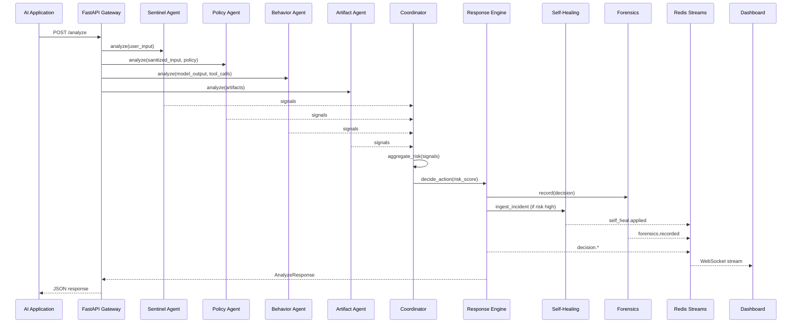
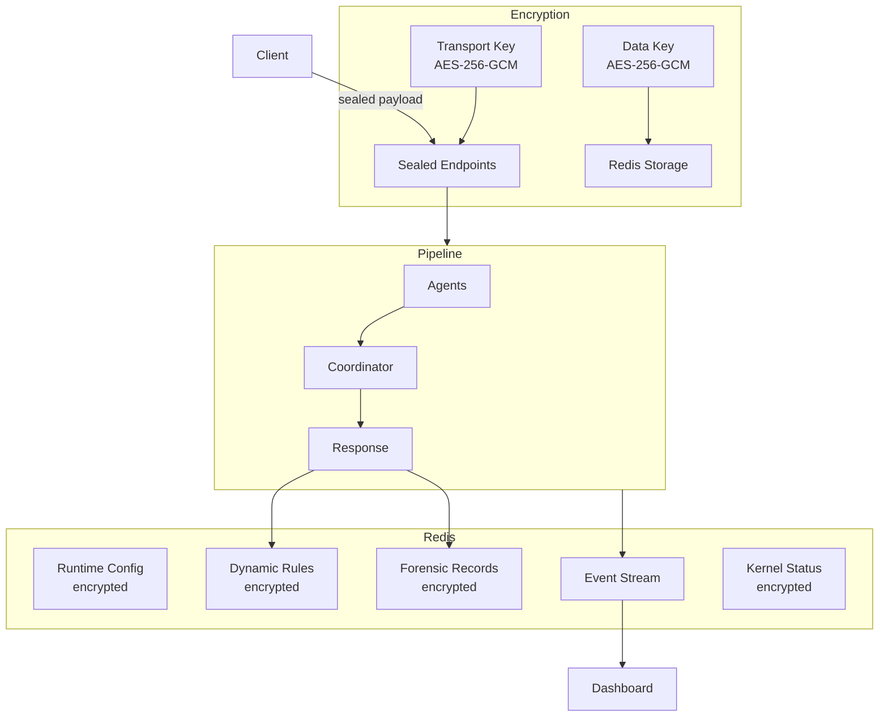

# Architecture

## Overview

AUTO DEFENSE is a multi-agent defense pipeline that sits between AI applications and their users. Every input, output, and tool call passes through a chain of specialized agents that score threats, sanitize content, and decide on autonomous responses — all in real time.



## Agent pipeline

The `DefensePipeline` in `backend/app/services/pipeline.py` orchestrates the full flow. Each agent is independent, stateless (except Forensics which writes to Redis), and returns a list of `AgentSignal` objects.

### Agent responsibilities

| Agent | File | Input | Output | Threat types |
|-------|------|-------|--------|-------------|
| **Sentinel** | `agents/sentinel.py` | `user_input` | Sanitized input, signals | `prompt_injection`, `jailbreak`, `data_exfiltration` |
| **Policy** | `agents/policy.py` | Sentinel's sanitized input + runtime policy regexes | Further-sanitized input, signals | `policy_violation` |
| **Behavior** | `agents/behavior.py` | `model_output`, `tool_calls` | Sanitized output, signals | `tool_abuse`, `data_exfiltration`, `anomaly` |
| **Artifact** | `agents/artifact.py` | `artifacts[]` | Artifact summary, signals | `anomaly`, `tool_abuse`, `policy_violation`, `malware_in_file` |
| **Coordinator** | `agents/coordinator.py` | All signals | Risk score, action decision, explanation | — |
| **Forensics** | `agents/forensics.py` | Request + decision | Encrypted record in Redis | — |
| **Kernel** | `agents/kernel.py` | Scanner findings | Signals | `rootkit`, `kernel_exploit`, `kernel_integrity`, `anomaly` |

### Signal flow

```
Sentinel ─┐
Policy   ─┤
Behavior ─┼──▶ Coordinator ──▶ aggregate_risk() ──▶ ResponseEngine ──▶ AnalyzeResponse
Artifact ─┘         │                                      │
                     │                                      ├──▶ Forensics (record)
                     │                                      └──▶ SelfHealing (if incident)
                     │
                     └──▶ Event Bus (Redis Streams)
```

## Risk scoring

The risk engine (`core/risk.py`) uses weighted aggregation across all agents. Each agent contributes a weighted score adjusted by detection confidence. Additional modifiers apply threat-class floors and multi-signal correlation bumps to prevent evasion through low-weight blending.

## Response engine

Maps risk score to autonomous action using configurable thresholds:

| Risk score | Action | Behavior |
|------------|--------|----------|
| 0–30 | `allow` | Pass through unchanged |
| 31–60 | `log_monitor` | Allow but log for review |
| 61–80 | `sanitize` | Redact dangerous content, allow sanitized version |
| 81–100 | `block_isolate` | Block entirely, null output |

The engine also enforces **escalation-only**: if the coordinator requests a stricter action than the risk score warrants, the stricter action wins.

## Self-healing

When a `sanitize` or `block_isolate` action occurs and self-healing is enabled:

1. The `SelfHealingEngine` examines the threat types in the decision
2. For each threat type, it attempts to extract a regex pattern from the attack input
3. New patterns are appended to dynamic rules stored (encrypted) in Redis
4. The `SentinelAgent` loads these dynamic rules on every request, immediately defending against similar attacks
5. Rule growth is bounded by `self_heal_max_rule_growth` (default 50)

Supported pattern generation covers prompt injection, jailbreak, data exfiltration, and tool abuse threat categories.

## Event streaming

All events flow through Redis Streams via the `EventBus` (`core/event_bus.py`):

| Event type | When |
|-----------|------|
| `request.received` | Every `/analyze` call |
| `decision.{allow,log_monitor,sanitize,block_isolate}` | After response engine decision |
| `scan.received` / `scan.decision.*` | After `/scan` call |
| `kernel.scan_received` / `kernel.decision.*` | After `/scan/kernel` call |
| `forensics.recorded` | After forensic record persisted |
| `incident.detected` | When self-healing triggers |
| `self_heal.applied` | When dynamic rules are updated |

The frontend consumes events via:
- **WebSocket** (`/events/ws`) — primary, with auto-reconnection and exponential backoff
- **SSE** (`/events/stream`) — fallback
- **REST** (`/events`) — initial load

## Data flow diagram



## Technology stack

| Layer | Technology |
|-------|-----------|
| Backend | Python 3.11, FastAPI, Pydantic, uvicorn |
| Event bus | Redis 7 Streams |
| Encryption | Python `cryptography` (AESGCM), Web Crypto API |
| Frontend | React 18, TypeScript, Vite 5, Tailwind CSS, Recharts |
| Serving | nginx (frontend), uvicorn (backend) |
| Containerization | Docker, Docker Compose |
