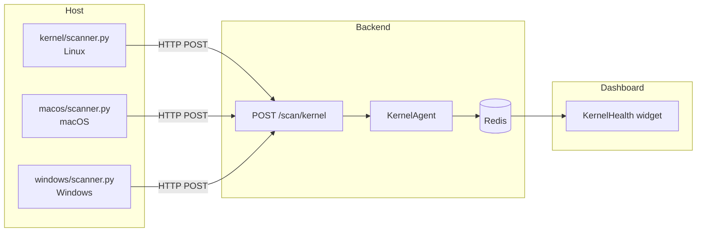

# Host Security Scanners

AUTO DEFENSE includes three standalone host security scanners — one per platform. Each is a single Python file with **zero external dependencies** (stdlib only), runs anywhere Python 3.8+ is installed, and POSTs structured findings to the backend.

## Architecture



All three scanners share the same CLI interface:

```bash
python3 <scanner> [--post URL] [--loop SECONDS] [--json]
```

**Backend contract:** scanners POST to `{backend_base}/scan/kernel` (same origin as other REST routes; no extra URL prefix in the default app). The backend verifies `X-Scanner-Signature` over the raw JSON body when `AUTODEFENSE_SCANNER_HMAC_KEY` is set. Match `--hmac-key` / `SCANNER_HMAC_KEY` to that env var on the server. Outside `local`, the API refuses unsigned kernel ingest if the HMAC key is unset.

| Flag | Purpose |
|------|---------|
| `--post URL` | POST results to the backend (e.g., `http://localhost:8000`) |
| `--loop N` | Repeat scan every N seconds (0 = one-shot, default) |
| `--json` | Print raw JSON to stdout instead of human-readable summary |

## Linux scanner (`kernel/scanner.py`)

Reads `/proc`, `/sys`, and the filesystem. No root required for basic detection; root recommended for full visibility.

### Detection checks

| Category | Check | How |
|----------|-------|-----|
| **Rootkit** | Hidden processes | Enumerate `/proc/[pid]` vs `/proc/[pid]/status` readability |
| | LD_PRELOAD hijacking | `LD_PRELOAD` env var + `/etc/ld.so.preload` |
| | Known rootkit paths | ~30 common drop locations (`/dev/.x`, `/usr/lib/.libx`, etc.) |
| | Suspicious `/dev` entries | Hidden files in `/dev` |
| | Malicious kernel modules | `/proc/modules` — known rootkit LKMs + out-of-tree modules |
| **Zero-day** | Deleted-exe processes | `/proc/[pid]/exe` → `(deleted)` |
| | Unexpected setuid binaries | Setuid/setgid outside standard paths |
| | Temp executables | Execute-permission files in `/tmp`, `/dev/shm`, `/var/tmp` |
| | Raw sockets | `/proc/net/raw` and `/proc/net/raw6` |
| **Integrity** | Kernel version | EOL kernel version ranges (3.x, 4.0–4.14) |
| | Sysctl hardening | `randomize_va_space`, `kptr_restrict`, `dmesg_restrict`, `ptrace_scope`, `unprivileged_bpf_disabled`, `sysrq` |
| | Security modules | SELinux enforcing, AppArmor enabled |
| | Boot file hashes | SHA-256 of `vmlinuz`, `initrd`, `initramfs`, `System.map` |
| | Container detection | `/.dockerenv`, cgroup content |
| **Network** | Unexpected listeners | `/proc/net/tcp` and `/proc/net/tcp6` |
| | Promiscuous interfaces | `/sys/class/net/*/flags` bit 0x100 |
| | Sniffer processes | 30+ tools detected via `/proc/[pid]/comm` and `/proc/[pid]/cmdline` |
| | Pcap files | `.pcap`, `.pcapng`, `.cap` in `/tmp`, `/var/tmp`, `/dev/shm`, `/root`, `/home` |
| | ARP spoofing | `/proc/net/arp` — duplicate MACs across IPs |

### Docker deployment

```bash
docker compose --profile security up kernel-scanner
```

The compose service uses `pid: host` and read-only mounts for `/proc`, `/sys`, `/boot`, `/dev`.

## macOS scanner (`macos/scanner.py`)

Uses macOS command-line tools (`csrutil`, `spctl`, `fdesetup`, `lsof`, `ifconfig`, `ps`, `osascript`, `systemsetup`).

### Detection checks

| Category | Check | How |
|----------|-------|-----|
| **Integrity** | SIP (System Integrity Protection) | `csrutil status` |
| | Gatekeeper | `spctl --status` |
| | FileVault | `fdesetup status` |
| | Application firewall | `socketfilterfw --getglobalstate` |
| | Firewall stealth mode | `socketfilterfw --getstealthmode` |
| | XProtect version | `/System/Library/CoreServices/XProtect.bundle` |
| | macOS version EOL | Flags High Sierra through Monterey |
| **Network** | Remote Login (SSH) | `systemsetup -getremotelogin` |
| | Open ports | `lsof -iTCP -sTCP:LISTEN` |
| | Promiscuous interfaces | `ifconfig -a` flags |
| | Sniffer/MITM processes | `ps axo pid,comm,args` — 30+ tools |
| | Pcap files | Desktop, Downloads, /tmp, /var/tmp |
| **Persistence** | LaunchDaemons | `/Library/LaunchDaemons/*.plist` (non-Apple) |
| | LaunchAgents | `/Library/LaunchAgents/*.plist` and `~/Library/LaunchAgents/*.plist` |
| | Login items | `osascript` System Events query |

### Hardening score

Calculated from: SIP + Gatekeeper + FileVault + Firewall = percentage (e.g., 4/4 = 100%).

## Windows scanner (`windows/scanner.py`)

Uses PowerShell cmdlets, `reg query`, `netstat`, `tasklist`, `schtasks`, `manage-bde`. Requires Python for Windows (3.8+).

### Detection checks

| Category | Check | How |
|----------|-------|-----|
| **Integrity** | Windows Defender | `Get-MpComputerStatus` (AV + real-time protection) |
| | Firewall profiles | `Get-NetFirewallProfile` (Domain, Private, Public) |
| | UAC | Registry `EnableLUA` |
| | BitLocker | `manage-bde -status` or `Get-BitLockerVolume` |
| | SMB v1 | `Get-SmbServerConfiguration` (WannaCry/EternalBlue surface) |
| | Secure Boot | `Confirm-SecureBootUEFI` |
| | Credential Guard | `Win32_DeviceGuard` CIM class |
| | PowerShell execution policy | `Get-ExecutionPolicy` (flags Unrestricted/Bypass) |
| | Windows version EOL | Flags Windows 7, 8, 8.1 |
| **Network** | RDP | Registry `fDenyTSConnections` |
| | Open ports | `netstat -an` LISTENING state |
| | Sniffer/MITM processes | `tasklist` — 25+ tools (Wireshark, WinDump, RawCap, SmartSniff, Fiddler, pktmon, etc.) |
| | Pcap/ETL files | %TEMP%, Desktop, Downloads, C:\Temp |
| **Persistence** | Scheduled tasks | `schtasks /Query` (non-Microsoft) |
| | Autorun registry | `HKLM\...\Run`, `HKCU\...\Run`, `HKLM\...\RunOnce` |

### Hardening score

Calculated from: Defender + Firewall + UAC + BitLocker + Secure Boot = percentage (e.g., 5/5 = 100%).

## Dashboard integration

The **KernelHealth** widget in the frontend:

1. Calls `GET /health` to detect the backend platform
2. Shows platform-appropriate scanner instructions (Linux/macOS/Windows command)
3. Calls `GET /kernel/status` to check for scan results
4. When a scan exists, displays:
   - Platform, version, hostname, container status
   - Hardening score as a percentage
   - Risk score (0–100) and response action badge
   - Expandable findings list sorted by severity (critical → low)
